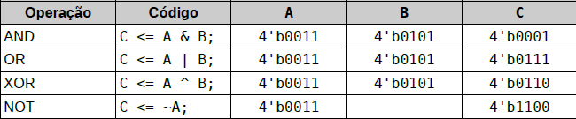
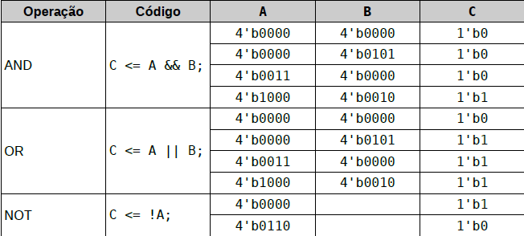
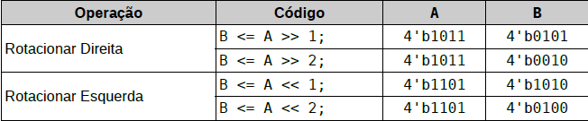
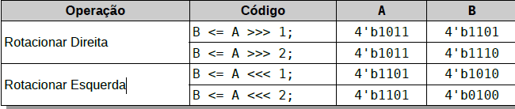
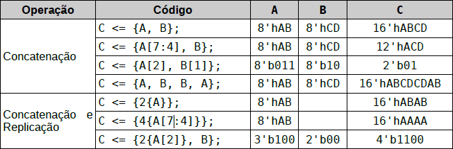
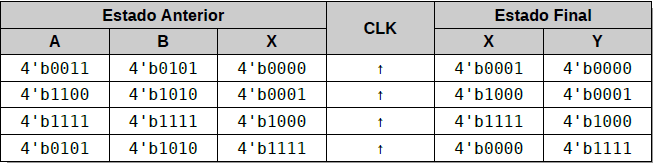

<!-- ================= CAPA ================= -->

<p align="center">
  <h1 align="center">Arquitetura de Sistemas Digitais</h1>
  <h3 align="center">Anotações referentes a linguagem Verilog</h3>
  <br>
  <p align="center">
    Autor: Arthur Emanuell de Sousa Firmino   
    <br>
    Data: 2026
  </p>
</p>

---

## Prefácio

Nesta anotação será falado um pouco sobre Verilog.

---

## Sumário

- [Capítulo 1 — Comentários](#capítulo-1--comentários)
- [Capítulo 2 — Variáveis](#capítulo-2---variáveis)
- [Capítulo 3 — Expressões e Operadores](#capítulo-3---expressões-e-operadores)
- [Capítulo 4 — Estruturas de Controle](#capítulo-4---estruturas-de-controle)
- [Capítulo 5 — Descrição de Circuitos Lógicos](#capítulo-5---descrição-de-circuitos-lógicos)
- [Capítulo 6 — Módulos](#capítulo-6---módulos)
- [Capítuo 7 — Exercícios](#capítulo-7---exercícios)

---

# Capítulo 1 — Comentários

- Explicação

Em sistem verilog, é possivel comentar linhas ou trechos de códigos, a partir da impletação de digitos ou combinações de digitos, parecido com C e C++.

 ### Exemplo
```verilog
    //Desta maneira você consegue comentar apenas uma linha do código.

    /*Desta outra maneira você consegue comentar mais de uma linha do código, até que chegue no próximo*/
```
---

# Capítulo 2 - Variáveis

System verilog é uma linguagem de descrição de circuitos lógicos, por tanto todos os valores representados estão em ordem binária. Desta forma, necessitamos de apenas um tipo logico para as variaveis, o tipo **logic**. O tipo logic pode assumir os seguintes valores: nivel lógico alto (1), nivel lógico baixo (0), alta impedância (Z) e o "não importa" ou "desconhecido" (X).

---

## 2.1 - Nomes de Variáveis

As variáveis em **verilog** podem ser escritas com letras, números e under-line. No entanto, não podem inciar com números, lembrando que letras maiusculas diferenciam de letras minusculas.

## 2.2 - Variáveis de 1 Bit

Para criar um variável com o nome **Sinal** é necessário apenas escrever o seguinte linha:
    
```verilog
    logic Sinal;
``` 
Para acessar o valor armazenado nesta variável, basta apenas escrever o valor desta variável.

## 2.3 - Variáveis maiores que 1 Bit

Para se declarar uma variável com mais de 1 Bit, se utiliza a forma de **palavra**, por exemplo, se quisessemos declarar uma variável de 8 Bits fariamos da seguinte maneira: 
```verilog
    logic [7:0] Palavra;
```
Se desejassemos ler a variavel completa, escreverimos apenas o nome da varável. No entanto, caso quisessemos ler uma parte específica da variável teriamos que especificar através de colchetes adicionando apenas o bit especifico que desejariomos ler, mas tambem poderimos ler uma faixa de bits, através da utilização do dois pontos ( : ). A seguir mostraremos como fazer a leitura individual e por faixa de bits:
```verilog
    // Leitura individual de bits
    Palavra[3]

    //Leitura de uma faixa de bits
    Palavra[3:7]
```
> **Observação**: No exemplo acima temos entendido que para determinar a quantidade de Bits é necessario especificar na seguinte ordem Palavra[7:3], isso implica dizer que o número da esquerda sempre será maior doque o número da direita quando estivermos falando de BIT.

## 2.4 - Memórias

Uma memória nada mais é que o agrupamento de palavras do mesmo tamanho (as palavras sempre terão o mesmo tamanho). Para criarmos uma memória chamada de **Dados** de 128 palavras de 8 bits, escrevemos o código da seguinte maneira:
```verilog
    logic [7:0] Dados [0:127];
```
Para acessar uma palavra especifica basta utilizar-se dos colchetes novamente:
```verilog
    //Para acessar uma palavra inteira na memória
    Dados [13];

    //Para acessar uma parte especifica e um dado especifico
    Dados [10] [3:0];
```
> **Observação**: Quando estivermos falando de memória, utilizaremos sempre primeiro (para sua leitura) qual palavra leremos e logo após qual o bit ou a faixa do bit a ser lida da palavra escolhida.

## 2.5 - Constantes Numéricas

Anteriormente havia sido comentado que o System Verilog trabalha com a base binária, no entanto, não a necessidade do usuário ficar preso apenas a base binária, ele podera utilziar outros tipos de base que desejar, podendo ser: binaria(b), deciaml(d), octal(o) e hexadecimal(h). Para que seja utilizado estes diferentes tipos de base, há a necessida de explicitar atraves de uma linha de codigo, como esta a seguir: 
```verilog
    16'd3456
```
Desta maneira escrita no código acima, foi especificado que é trata-se de uma base decimal (d), que possui um total de 16 bits, e que o valor tratado em decimal é 3456.

Para fim de auxiliar na leitura numérica, pode ser utilizado o under line (_), que não altera o valor do número escrito e acaba facilitando a leitura.
```verilog
    64'd6_000_000_000
```
Números decimais também podem ser escritos sem o uso de designação de base, ou seja, sem (16'd ou 64'd), no entando só será utilizado a quantidade de bits que será ocupado por aquele valor. o número 3456 não seria escrito com 16 bits, mas sim com 12.

Nas bases binária, octal e hexadecimal também se pode utilizar os símbolos x e z como parte do número. A notação 4'b0zz1 representa um número de 4 bits onde os bits 1 e 2 estão em alta impedância, e a notação 5'b101xx representa um número de 5 bits onde os bits mais altos são 101 e os mais baixos não importam.

Quando usada a notação octal cada símbolo representa um grupo de 3 bits, portanto a notação 9'o77z representa um número de 9 bits onde os bits 8 a 3 estão em nível alto e os bits 2 a 0 estão em alta impedância. Da mesma forma na base hexadecimal cada simbolo representa um grupo de 4 bits, portanto 16'xx00 representa um número de 16 bits onde os 8 bits menos significativos estão em nível lógico baixo e os 8 bits mais significativos não importam.

# Capítulo 3 - Expressões e Operadores

Em System verilog, as relações entre sinais podem ser representadas por expressões lógicas, as quais são escritas como um conjunto de operações terminadas por ponto e virgula ( ; ).

## 3.1 - Operadores de Atribuição

Em System Verilog existe duas maneiras de atribuir o valor a uma variável, sendo elas o igual (=) ou o menor-igual (<=). A diferença entre elas será discutido posteriormente. No entando, elas podem ser utilizadas para copiar uma variável por completo, ou apenas uma parte desta variável, da seguinte maneira: 
```verilog
    //Maneira de atribuir a variavel por completo
    A <= B;
    A = B;

    //Maneira de atribuir uma parte especifica do bit para outra variável
    A[4:0] <= B[7:4];
```
> **Observação**: A parte de atribuição de uma parte especifica da variável é bem parecida com a parte de leitura previamente lido.

## 3.2 - Operadores Lógicos 

As operações lógicas básicas são: AND (&), OR (|), XOR (^) e NOT (! ou ~). No entando, se fosse se tratar apenas de variável de apenas 1 bit, tudo ocorreria normalmente, mas quando se trata de mais de um bit há a necessidade de utilizar diferentes tipos de operadores.

### 3.2.1 - Operadores por Bit

Os operadores por Bit realizam a mesma operação por cada bit das variáveis envolvidas, por exemplo:
```verilog
    C <= A & B;
```
Desta maneira, significa que a operação AND realizada entre a variável A e B, possuiu uma relação por cada bit das variáveis, ou seja: 
```verilog
    C[0] <= A[0] & B[0];
    C[1] <= A[1] & B[1];
    C[2] <= A[2] & B[2];
    C[3] <= A[3] & B[3];
```



Desta maneira é possivel perceber que a realização das operações ocorre para cada bit da variável.

### 3.2.2 - Operadores de Redução

O operador de redução já é explicado pelo próprio nome, onde funciona da seguinte maneira, ele converte uma determinada quantidade de bits em apenas um unico bit, por exemplo:

-  Se tivermos uma variavel com 4 bits, ela será reduzida para um único bit.

```verilog
    A <= &B;
```
É o mesmo que: 
```verilog
    A <= B[0] & B[1] & B[2] & B[3];
```
No caso de utilizar o operador AND (&) como redução, a quantidade de bits da variável que será reduzida será proporcional a tabela que será feita, por exemplo: 

- Se fossemos utilizar a variável de redução com 2 bits a tabela ficaria da seguinte maneira:


### 3.2.3 - Operador por Palavra

O operador por palavra, toma uma variável como nivel lógico um sempre que houver um (1) em algum de seus bits, e sempre o valor do resultado entre as duas ou mais variáveis será de um unico bit.

- Exemplo:

```verilog
    C <= A && B;
    c <= A || B;
    C <= !A;
```

- Maneira visual para entendimento:



> **Observação**: Vale salientar que independente da quantidade de bits que houver na palavra sempre será investigado os bits por inteiro.

### 3.2.4 - Operadores de Deslocamento Lógico

É possivel deslocar bits de uma palavra para a esquerda ou para direita utilizando os operadores menor-menor (<<) ou maior-maior (>>) respectivamente. Bits deslocados para fora da palavra são preenchidos com 0.

- Exemplo:

```verilog
    B <= A >> 1;
```
- É o mesmo que escrever:

```verilog
    B[0] >> A[1];
    B[1] >> A[2];
    B[2] >> A[3];
    B[3] >> 0;
```

- Visualmente melhor para entendimento:



## 3.3 - Operadores Aritméticos

Em system verilog também são ofertados operadores aritméticos básicos, sendo eles: Adição (+), Subtração (-), Multiplicação (*), Divisão (/), Resto da Divisão (%) e Potênciação (**). No entanto, por system verilog se tratar de cicuitos lógicos, a implementação de recursos mais complexos como pontênciação, divisão, multiplicação e resto da divisão podem acarretar em circuitos mais complexos.
```verilog
    //Adição 
    A <= B + C;
    //Subtração
    A <= B - C;
    //Multiplicação
    A <= B * C;
    //Divisão
    A <= B / C;
    //Potênciação
    A <= B ** C;
    //Resto da Divisão
    A <= B % C;
```
### 3.3.1 - Operadores de Deslocamento Aritmético

Os operadores de deslocamento aritmético funcionam parecidos com o deslocamento lógico, no entanto ele considera o sinal, ou seja, se tivermos um número negativo é possivel realizar o deslocamento sem que o mesmo perca o sinal.

Para isso, ele irá preservar o bit de sinal e deslocará os bits em diante, por exemplo:
```verilog
    B <= >>> 1;
```
Isso é a mesma coisa que:
```verilog
    B[0] <= A[1];
    B[1] <= A[2];
    B[2] <= A[3];
    B[3] <= A[3];
```
De maneira visualmente mais fácil de compreender: 



> **Observação:** Apenas mantém o sinal quando deslocado para a direita, caso seja deslocado para a esquerda perde o bit de sinal, gerando assim um overflow.

## 3.4 - Operadores de Comparação

Os operadores de comparação irão simplesmente comparar os valores das variáveis e dar um valor de um único bit. A sintaxe do texto para os operadores de comparação é:
```verilog
    //Maior
    A <= B > C;
    //Maior-Igual
    A <= B >= C;
    //Menor
    A <= B < C;
    //Menor-Igual
    A <= B <= C;
    //Igual
    A <= B == C;
    //Diferente
    A <= B != C;
```
> **Observação:** Caso a comparação seja verdadeira a saída será (1), caso a comparação seja falsa a saída será (0).

## 3.5 - Operador de Concatenação e Replicação

Para agrupar diversos bits ou palavras é utilizado o operador de concatenação {}, tal que também seja possivel implementar quantas vezes dado fragmento será repetido.
```verilog
    //Concatenação
    A <= {C,B};

    //Replicação
    A <= {2{B}};
```
- Para uma melhor visualização:



## 3.6 - Operador Condional

O operador condicional opera parecido como um multiplexador, onde dependendo da entrada do seletor ele irá escolher entre a primeira saida caso seja verdadeira, ou a segunda saida caso seja falsa.
```verilog
    Y <= SEL ? XV : XF;
```
Caso o valor de SEL for verdadeiro a saida selecionada será XV, caso seja falsa a saída será XF.

# Capítulo 4 - Estruturas de Controle

A fim de simplificar processos de operações lógicas, é possivel utilizar estruturas de controle.

## 4.1 - Estrutura condicional IF-ELSE.

Quando se deseja executar dois conjuntos distintos de comandos dependendo de uma condição ser atendida ou não, então utiliza-se a estrutura condicional IF-ELSE.

```verilog

    if (condição)
    begin
        // Atribuições ou outras estruturas de controle.
        // Executam apenas quando a condição for verdadeira.
    end
    else
    begin
        // Atribuições ou outras estruturas de controle.
        // Executam apenas quando a condição for falsa.
    end
```
- Também é possivel concatenar funções da seguinte maneira:

```verilog
    if (condição1)
    begin
        // Atribuições ou outras estruturas de controle.
       // Executam apenas quando a condição1 for verdadeira.
    end
    else if (condição2)
    begin
        // Atribuições ou outras estruturas de controle.
        // Executam apenas quando a condição1 for falsa e a condição2
        // verdadeira.
    end
    else
    begin
        // Atribuições ou outras estruturas de controle.
        // Executam apenas quando ambas as condições forem falsas.
    end
```

Caso seja necessário apenas um único comando, é possivel omitir o begin e o end.

```verilog
    if (condicao) Y <= A-B;
    else          Y <= A+B;
```

## 4.2 - Estrutura de CASE

Quando se deseja usar uma variável para selecionar uma de diversas opções pode-se utilizar o condicional case. Este condicional compara o valor de uma variável (SELETOR) com uma lista de constantes, e executa apenas um conjunto de comandos selecionado pela variável.
```verilog
    case (SELETOR)
    4'b0100:
        Y <= A + B; // Executa apenas quando SELETOR == 4
    4'b0010:
        Y <= A - B; // Executa apenas quando SELETOR == 2
    4'b0101:
        Y <= A & B; // Executa apenas quando SELETOR == 5
    4'b1100:
        Y <= A | B; // Executa apenas quando SELETOR == 12
    default:
        Y <= 0; // Executa quando o SELETOR não aparece na lista.
    endcase
```
## 4.3 - Estrutura condicional CASEX

O condicional casex opera de maneira muito semelhante ao condicional case, mas permite também o uso de bits 'não-importa' (x) na lista de constantes. Isto é útil na simplificação de descrições, pois evita a repetição desnecessária de código.
```verilog
    casex (SELETOR)
    4'bx100:
        Y <= A + B; // Executa quando o SELETOR é 4 ou 12.
    4'b001x:
        Y <= A - B; // Executa quando o SELETOR é 2 ou 3.
    4'b0x01:
        Y <= A & B; // Executa quando o SELETOR é 1 ou 5.
    4'b10x0:
        Y <= A | B; // Executa quando o SELETOR é 8 ou 10.
    default:
        Y <= 0; // Executa quando o SELETOR não aparece na lista.
    endcase
```
# Capítulo 5 - Descrição de Circuitos Lógicos

Os Circuitos lógicos podem ser divididos em 2 tipos de grupo, os que dependem de uma sequencia, ou seja, de um flip flop, e os que dependem apenas da entrada, ou seja, a saida será diretamente ligada a entrada, sendo os circuitos combinacionais.

## 5.1 - Circuitos Combinacionais

Para a implementação de um circuito combinacional é utilizado o bloco always_comb, em uma notação como mostrada abaixo:
```verilog
    always_comb
    begin
        X = A & B;
        Y = B;
    end
```
> **ATENÇÃO:** Note que o operador de atribuição é apenas o igual (=) e não o menor-igual (<=).

Entre as linhas de begin e end podem ser utilizadas atribuições de lógica combinacional, e as saídas X e Y serão atualizadas assim que A ou B mudarem de valor.Também podem ser utilizadas as estruturas de controle if-else, case e casex na descrição da lógica combinacional, mas deve-se observar que sejam atribuições completas. Por atribuição completa entenda que se uma variável Y receber uma atribuição em uma das condições, então ela deve receber atribuição em todas as condições. Ou seja, se Y recebe uma atribuição no bloco do if então ela deve obrigatoriamente receber uma atribuição no bloco do else, e da mesma forma se Y recebe uma atribuição numa das condições do case ou casex então ele deve receber atribuições em todos os demais.
```verilog
    always_comb
    begin
        if(SELETOR==0)
        begin
            Y = X0;
        end
        else
        begin
            Y = X1;
        end
    end
```
## 5.2 - Circuitos Sequênciais

Para a implementação de circuitos síncronos é usado um bloco always_ff, e o operador de atribuição <= (menor igual) como mostrado abaixo:
```verilog
    always_ff @(poseedge CLK)
    begin
        //Atribuições sequenciais, como por exemplo
        X <= A & B;
        Y <= X;
        //Também podem ser utilizadas estruturas de controle.
    end
```
Note que as expressões lógicas utilizadas são semelhantes às do exemplo anterior, porém por se tratar de um circuito sequencial as saídas são flip-flops acionados pela borda de subida do sinal CLK, e somente terão seu valor alterado quando este sinal variar de acordo.

Deve-se notar que as atribuições de lógica sequencial são executadas todas simultaneamente e de forma paralela. Isto implica que, no exemplo anterior, Y receberá o valor que X possuía logo antes de borda de subida do relógio.



Caso seja necessário tambem é possivel utilizar a borda de descida em vez da borda de subida, bastando para isto substituir **posedege** por **negedge** como mostrado abaixo:

    always_ff @(negedge CLK)

- É possivel criar um circuito sensivel a ambas as bordas de um sinal usando:
```verilog
    always_ff @(posedge SINAL or negedge SINAL)
```
- Da mesma maneira é possivel criar circuitos com sinais diferentes:
```verilog
    always_ff @(posedge SINAL1 or negedge SINAL2)
```
Diferente dos circuitos combinacionais, não há a necessidade de existir atribuições completas,por exemplo, caso numa implmentação de uma variável Y em um **IF** não há a necessidade de implementar um **else** para a mesma variável, pois o valor "defalt" que a variável utilizaria seria a armazenada anteriormente.

## 5.3 - Revisitando os Operadores de Atribuição

 - Para facilitar o entendimento posterior, vamos primeiro saber a diferença entre menor-igual (<=) e igual (=).

Quando utilizamos do menor-igual (<=) é como se agendassemos a atualização da variável para o final do ciclo. No entando, quando utilizamos o igual(=), temos a atualização da variável imediatamente, onde definimos o <= como Não Bloqueante e o = como Bloqueante.

- Exemplo

Vamos declarar o valor das seguintes variáveis: X = 10 E Y = 20.

```verilog
    X = 10;
    Y = 20;
    A <= X; // pelo fato de o termo de atribuição ser o <=, ele agendará a mudança para o final
    X = Y; // pelo fato de o termo de atribuição ser o =, ele muda instantaneamente
    B <= X; // pelo fato de o termo de atribuição ser o <=, ele agendará a mudança para o final
```

O resultado final que teremos é o seguinte: A = 10 e B = 20.

# Capítulo 6 - Módulos

Módulos são unidades da descrição que contem entradas e saídas, e uma descrição das relações entre estas. A partir da utilização de módulos é possivel organizar um circuito lógico que seria complexo de maneira facil.

## 6.1 - Definição de Módulos

A definição de módulos é composta por 3 partes fundamentais: **Identificação do Módulo**, **Lista de portas**, e **Descrição da Funcionalidade**. No exemplo abaixo, um módulo chamado minha_and possui entradas lógicas A e B, e uma saída Y dada pela operação AND. **É recomendado que cada módulo seja descrito em um arquivo fonte distinto (texto puro ASCII), de preferência com o mesmo nome do módulo mais o sufixo da linguagem**.

```verilog

    //Identificação do Módulo
    module minha_and(
        //Lista de Portas
        input A,B,
        output Y
    );
        //Descrição de Funcionalidade
        always_comb
        begin
            Y = A && B;
        end
    endmodule

```
> **Observação**: Note que utilizamos o sinal de (=) dentro do always_comb.

- Definição de Portas:

Portas de **Entrada** são definidas com a denominação input e nunca devem receber atribuições dentro do módulo. Portas de **Saída** são definidas com a denominação output e devem obrigatoriamente receber atribuições no módulo. Portas **Bidirecionais** são definidas com a denominação inout, e podem ou não receber atribuições. A direcionalidade de uma porta inout é controlada pelo valor atribuído a ela no módulo, operando como entrada enquanto a porta recebe
uma atribuição de alta impedância (z) e como saída em caso contrário.

## 6.2 - Instanciação de Módulos

Quando um módulo utiliza em sua construção um bloco lógico definido, geralmente em um arquivo distinto, por outro módulo diz-se que o primeiro está instanciando o segundo. Este mecanismo é extremamente útil na representaão de blocos repetitivos da descrição, ou quando se deseja gerenciar a complexidade de um grande problema dividindo-o em diver problemas menores e de solução mais simples.

Um módulo que instancia outros módulos é chamado de módulo pai, e um módiulo que é instanciado por outro módulo é chamado de módulo filho. É necessario que exista um módulo não instanciado por outros chamado de módulo raiz, ou modulo top-level design entity, e suas portaas descrevem as conxões do circuito para o mundo externo.

A instânciação de um módulo é feita parecido como a declaração de uma variável, especificando-se o tipo do módulo filho e o nome da instância, porém é necessário especificar coom serão conectadas as portas.

```verilog
    nome_modulo nome_instancia(lista,de,conexoes);
```

Em System Verilog existem 3 maneiras de conexão de portas: **por posição**, **por nome** e **por casamento**.

Na conexão por posição o módulo pai especifica, na lista de conexões, os nomes dos sinais do módulo pais que devem ser conectados às portas do filho na mesma ordem em que foram declarados no módulo filho. É uma rapida e fácil forma de conexão, no entanto acaba dificultando na hora de realizar alguma manutenção no código.

> **Observação**: O módulo pai é o modulo top.

Para que possamos exemplificar, vamos criar o módulo **FILHO**:

```verilog
    // --- O MÓDULO QUE VAMOS INSTANCIAR (A PLANTA) ---
    module mux2 (
        input  logic a,
        input  logic b,
        input  logic sel,
        output logic y
    );
    always_comb
    begin
        y = sel ? a:b;
    end
endmodule
```

- Exemplo de um código instanciado por posição:

```verilog
    module top_ordem (
        input logic in1, in2, s,
        output logic saida
    );
        // Instanciando:
        // O compilador assume: a=in1, b=in2, sel=s, y=saida
        mux2 u1 (in1, in2, s, saida); 
    endmodule
```

Na conexão por nomes especifica-se individualmente a qual porta devem ser conectados os sinais do módulo pai. Para tal, na lista de conexões usa-se a notação .porta(sinal), que conecta o sinal de nome sinal do módulo pai à porta de nome porta do módulo filho.

- Exemplo de um código instanciado por nome:

```verilog
    module top_nome (
        input logic in1, in2, s,
        output logic saida
    );

    // Instanciando:
    mux2 u2 (
        .sel (s),     // Conecta 's' na porta 'sel' (ordem não importa)
        .a   (in1),   // Conecta 'in1' na porta 'a'
        .b   (in2),   // Conecta 'in2' na porta 'b'
        .y   (saida)  // Conecta 'saida' na porta 'y'
    );
endmodule
```

Desta maneira, a chance de ter dor de cabeça mais a frente diminui, ja que a chance de conexão entre portas erradas também diminui.

Finalmente a descrição por casamento é realizada especificando .* como o último argumento da lista de conexões. Este marcador afeta todas as portas do módulo filho que ainda não foram conectadas, e cria conexões com os sinais de mesmo nome no módulo pai. Desta forma é possível várias (ou todas) as portas de um módulo com grande agilidade.

- Exemplo de um código instânciado por casamento:

```verilog
    module top_casamento (
        // Note que os nomes aqui SÃO IGUAIS aos do módulo mux2
        input logic a, b, sel, 
        output logic y
    );

    mux2 u3 (
        .a,    // Equivale a .a(a)
        .b,    // Equivale a .b(b)
        .sel,  // Equivale a .sel(sel)
        .y     // Equivale a .y(y)
    );
endmodule
```

### 6.2.3 - Demosntração de criação de um circuito

1° - Primeiro vamos criar o módulo base, que será um flip-flop do tipo D, para montarmos o nosso circuito 1:

```verilog
    module dff(
        input logic D,CK,
        output logic Q
    );
        always_dff @(posedge CK)
        begin
            Q <= D;
        end
    endmodule
```

2° - Segundo vamos criar o cricuito 1:

```verilog
    module circuito1(
        input logic D1,CK1,
        input logic CK2,D,CK,
        output logic Q2, Q
    );
        logic Q1;

        dff FF1(
            .D(D1),
            .CK(CK1),
            .Q(Q1)
        );

        dff FF2(
            .D(Q1),
            .CK(CK2),
            .Q(Q2),
        );

        dff FF3(
            .D(D),
            .CK(CK),
            .Q(Q),
        );
    endmodule
```

## 6.3 - Módulos Genéricos ou Parametrizados

Alguns tipos de circuitos lógicos possuem um comportamento genérico similar, embora diferente apenas por alguns parâmetros operacionais. Exemplos deste tipo de circuitos são multiplexadores, demultiplexadores e memórias. Considere o multiplexador do exemplo abaixo.

```verilog
    module mux8(
        input logic [7:0] X,
        input logic [2:0] SEL,
        output logic Y
    );
        always_comb
            Y = X[SEL];
    endmodule
```
Se quisermos criar um novo multiplexador para 64 entradas seria suficiente modificar a entrada para [63:0] X e o seletor para [5:0] SEL, sem qualquer alteração da lógica de funcionamento do circuito. Criar um novo módulo somente para esta pequena alteração seria desperdício de esforço, além de complicar a manutenção do código posteriormente. Uma alternativa seria tornar o módulo muxN parametrizado, se forma que ele possa descrever o comportamento de um multiplexador com N seletores e 2N entradas.

A declaração de um módulo parametrizado é muito semelhante a de um módulo simples, como pode ser visto abaixo. A lista de parâmetros do módulo é declarada logo antes da lista de portas usando a notação #( parameter NOME = VALOR, ... ), onde NOME é o nome do parâmetro e VALOR é o valor padrão deste parâmetro.

```verilog
    module muxN
    #(
        parameter N = 3
    )
    (
        input logic [2**N-1 : 0] X,
        input logic [ N-1 : 0] SEL,
        output logic Y
    );
        always_comb
            Y = X[SEL];
    endmodule
```
- Durante a instanciação do módulo é possível alterar o valor dos parâmetros como mostrado abaixo.

```verilog
    muxN mux8_1 (X1, SEL1, Y1); // N=3, valor padrão
    muxN #(6) mux63_1(X2, SEL2, Y2); // N=6, 64 entradas
    muxN #(N=4) mux16_1(X3, SEL3, Y3); // N=4, 16 entradas
```

### 6.3.1 - Módulos de Instanciação Primitivos

Os módulos de instanciação primitivos são módulos pré-definidos pela linguagem System Verilog, na qual apresenta todos os operadores lógicos basicos da maneira de módulos, por exemplo:

```verilog
    and and1 (S,E1,E2);
    or or1 (S,E1,E2);
    xor xor1 (S,E1,E2);
    not not1 (S,E);
```
Desta maneira é vista que podemos utilizar módulos para operarem como portas lógicas básicas.

# Capítulo 7 - Exercícios

- Exercicio 1: Utilizando apenas instanciação, construa um módulo Maioria considerando: 

    a) O módulo deve ter 4 portas de entrada A,B,C,X, e uma saída Y.

    b) Quando a maioria dos sinais A,B e C forem verdadeiros, Y deve ter o mesmo valor de
    X, ou zero em caso contrário.

    c) Construa a tabela verdade, esboce o circuito lógico, dê nomes aos sinais internos, e
    crie o módulo Maioria em SystemVerilog utilizando apenas instanciação de portas
    primitivas.

    d) Instancie Maioria em top, conectando às chaves e LEDs como necessário.

    e) Compile, grave e teste o teste o circuito. 

```verilog
    module Maioria(
	input A,B,C,X,
	output Y	
);

	logic AB,BC,AC,maioria;

	and and1(AB,A,B);
	and and2(BC,B,C);
	and and3(AC,A,C);
	or or1(maioria,AC,BC,AB);
	and and4(Y,maioria,X);
	
endmodule
```

Inicialmente foi criado o modulo Maioria, que verificaria se haveria a maioria das entradas em 1.

```verilog
    module top (
    input  logic         CLK50,
    input  logic [17:0]  SW,
    input  logic  [3:0]  KEY,
    output logic [17:0]  LEDR,
    output logic [8:0]   LEDG,
    output logic [6:0]   HEX [7:0]
);
	Maioria m1(
		.A(SW[0]),
		.B(SW[1]),
		.C(SW[2]),
		.X(SW[3]),
		.Y(LEDR[0])
	);

endmodule
```

Logo após foi feita a instanciação do módulo Maioria no módulo pai, o módulo top.

- Exercicio 2: Construir um decodificador de hexadecimal para 7 segmentos com sinal de habilitação.
    a) O módulo deve ser chamado d7s, possuir uma entrada X com 4 bits, uma entrada EN
    com 1 bit, e uma saída Y com 7 bits.
    b) Quando EN estiver ativo o número da entrada deve ser mostrado no display. Quando
    inativo o display deve apagar.
    c) Para testar, conecte via top as chaves SW[3:0] como X, a chave SW[17] como EN,
    e o o display HEX[0] como Y.

```verilog
module d7s(
	input [3:0]X,
	input EN,
	output [6:0]Y
);
always_comb
begin

	if(EN)
	begin
		case(X)
		4'h1:
			Y = 7'b0110000;
		4'h2:
			Y = 7'b1101101;
		4'h3:
			Y =7'b1111001;
		4'h4:
			Y = 7'b0110011;
		4'h5:
			Y = 7'b1011011;
		4'h6:
			Y = 7'b0011111;
		4'h7:
			Y = 7'b1110000;
		4'h8:
			Y = 7'b1111111;
		4'h9:
			Y = 7'b1110011;
		default:
			Y = 7'b1111110;
		endcase
	end
	else
	begin
		Y = 7'b0000000;
	end
end
endmodule
```

Neste caso foi feito a parte de conversão de hexadecimal para os 7 bits do display de 7 segmentos.

> **Importante:** É importante frizar que sempre que vc alterar uma variável no IF, quando for uma estrutura de always_comb, sempre tera que atribuir um valor a essa variável, mesmo que seja no else.

```verilog
module top (
    input  logic         CLK50,
    input  logic [17:0]  SW,
    input  logic  [3:0]  KEY,
    output logic [17:0]  LEDR,
    output logic [8:0]   LEDG,
    output logic [6:0]   HEX [7:0]
);

d7s display(
	.X(SW[3:0]),
	.EN(SW[4]),
	.Y(HEX[0])
);

endmodule

```

Representação do aquivo pai.

Exercicio 3: